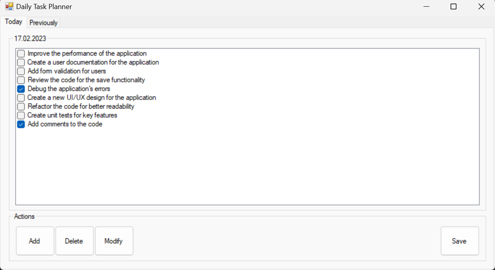

# Daily Task Planner 📝

> A simple and efficient to-do list application built with Windows Forms and C#, for managing daily tasks.

## Introduction
A user-friendly solution for managing tasks and keeping track of daily progress. With the ability to add, remove, and modify tasks, as well as save tasks for each day and view task history, this application is designed to make task management easy and convenient. This project is part of my portfolio to demonstrate my experience and skills in software development.

## Getting Started
This project was developed using C# and Windows Forms, and requires the .NET Framework to run. No additional dependencies or prerequisites are required. To get started, simply download the source code and open it in Visual Studio.

## Features
- 🗹 Add, remove, and modify tasks
- 📅 Save tasks for each day 
- 🔍 View task history 

## Releases
[Here](https://github.com/s-mohamed-dev/portfolio-csharp-daily-task-planner/releases/tag/v1.0) you can find the compiled versions of the Daily Task Planner application, ready for use. Simply download the desired version and run the executable file to start using the application.

## Demo
Here is a screenshot of the Daily Task Planner application interface to see how you can use it to add, modify, delete, and save tasks. The application offers a user-friendly experience and allows you to save tasks for each day and view task history.

## Conclusion
I hope this to-do list application will be a valuable tool for anyone who needs to manage their daily tasks and keep track of their progress. Thank you for considering this project!
